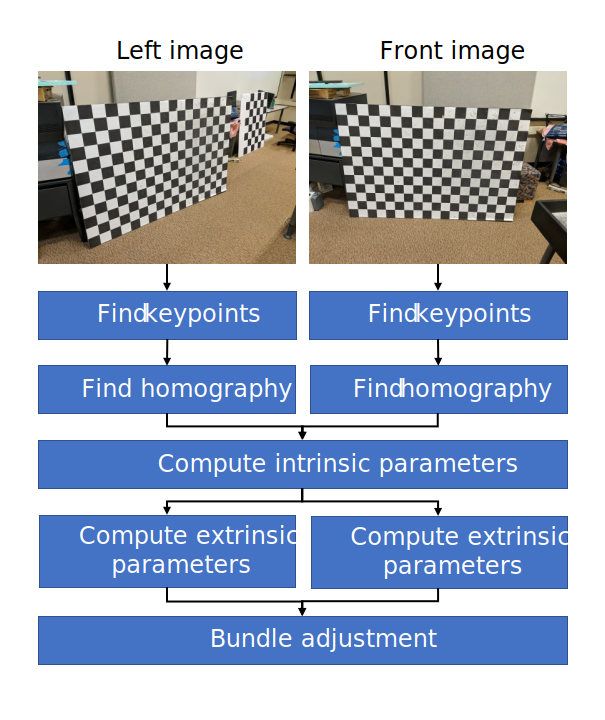

# CS635: Assignments

A repo that contains my assignments for the class CS-635 at Purdue University.

## Assignment 1: Camera Calibration
The objective of this assignment is to calibrate the intrinsinc and extrinsic parameters of a camera. I used my phone to capture two images from a chessboard pattern and Implemented Zhang's Camera Calibration algorithm. The verification of proper calibration is by visual re-projection of the calibration points. I also compare my results to the OpenCV [cv::calibrateCamera](https://docs.opencv.org/3.4.1/d9/d0c/group__calib3d.html#ga3207604e4b1a1758aa66acb6ed5aa65d) function.

Reference paper: Zhang, Z. (2000). A flexible new technique for camera calibration. *IEEE Transactions on pattern analysis and machine intelligence*, 22(11), 1330-1334.

## Assignment 2: Scene reconstruction
The objective of this assignment is to reconstruct a 3D scene using the previously developped camera calibration code. Again, I used my phone to capture several images of a 3D scene I created. Some objects are easy to reconstruct (a small box), others are impossible to reconstruct (a Ferrero Rocher). Here is one of the 16 images:

I used a basic algorithm. First, I automatically calibrate all 16 images using the chessboard and I estimate the poses of cameras. Then, I manually clicked feature points on each image. Each feature point is automatically reconstructed in the 3D scene using a linear system of equations and then a non-linear least square refinement. Then, I computed a 2D Delaunay triangulation of keypoints visible in the principal view (it’s possible to choose the principal view). Finally, I build a mesh out of the triangles and texture it with the image associated to the principal view. The whole 3D scene is displayed in an OpenGL view, with all original images displayed as transparent textures.

## Author
Mathieu Gaillard
